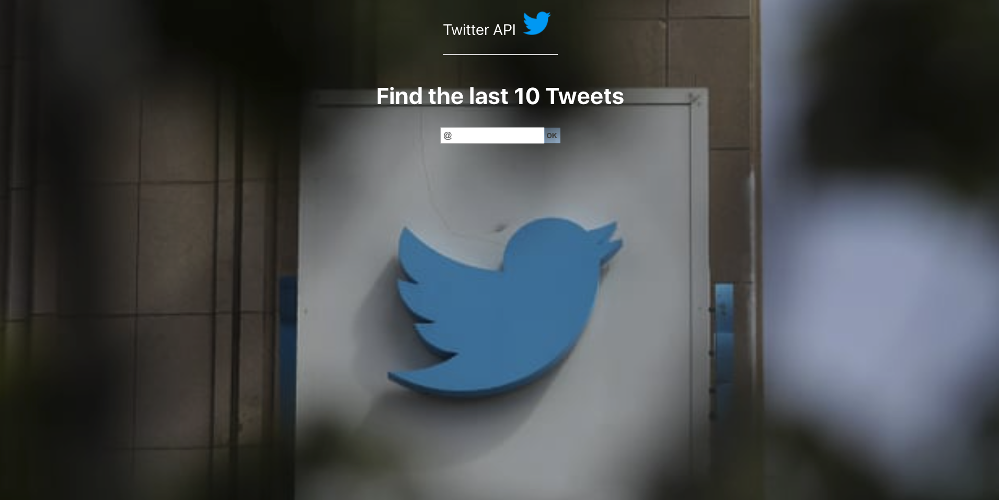
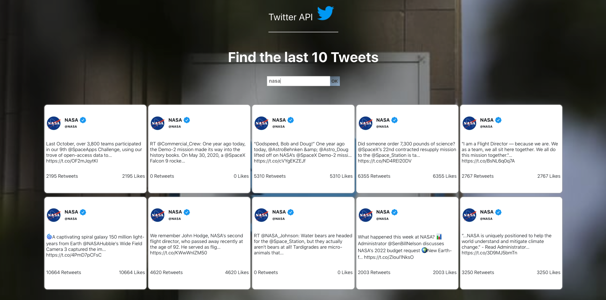

# Getting Started with Create React App

This project was bootstrapped with [Create React App](https://github.com/facebook/create-react-app).

To get started, please clone this repo and follow the below instructions:

1) cd into PoleStar and run yarn or npm install. Then run yarn start or npm start
2) cd into server,  Then run node server.js
3) Open http://localhost:3000 and begin creating a todo list.

